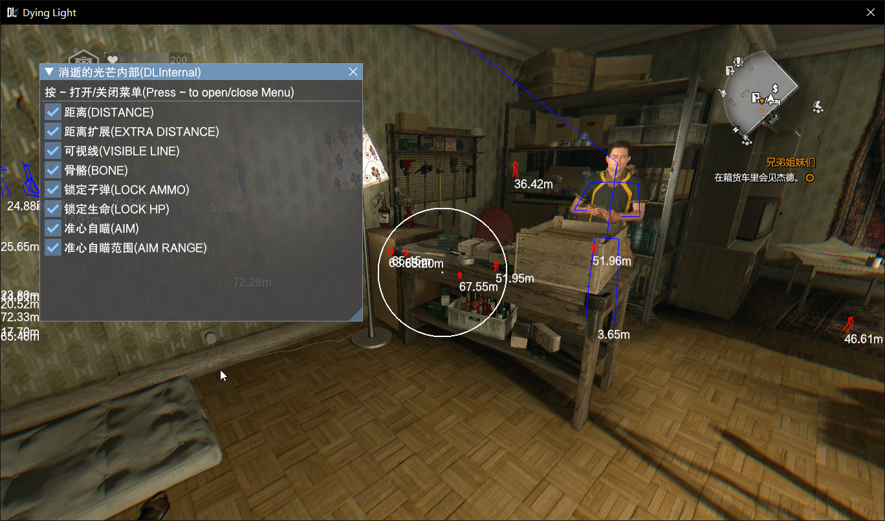

# dying light(dx11) internal hack



依赖缺失，暂不可编译

## 使用方式

用 dll 注入工具将 dll 注入游戏进程

注意自瞄不完善

## 编译/Compile

```rust
cargo +stable build --release
```

## 引用/Reference
Rewritten in Rust https://github.com/TKazer/DyingLight_Internal

Authorized by the original author
